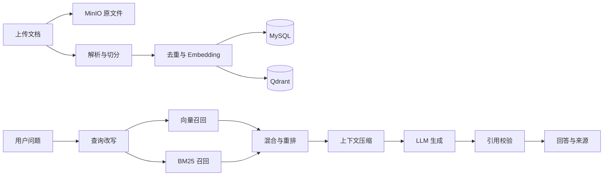

# AI Study RAG

一个基于 Spring Boot 3 的知识库问答后端。项目覆盖从文档上传、解析、切分和向量化，到混合检索、重排、上下文压缩、LLM 回答、引用校验及 RAG 效果评测的完整流程。

> 当前仓库是后端服务，不包含 Web 前端。接口默认监听 `http://localhost:8080`。

## 功能特性

- 支持上传 `txt`、`md`、`docx`、`pdf`，单文件默认最大 50 MB
- 使用 MinIO 保存原始文件，并异步完成解析、切分和索引
- 支持语义切分、内容哈希去重和可选的近似去重
- 使用 Qdrant 保存向量索引，MySQL 保存业务数据与 chunk
- 结合向量召回和 BM25 关键词召回，并支持结果重排
- 支持查询改写、关键词扩展和上下文压缩
- 生成带来源编号的回答，并对引用进行校验和修复
- 内置评测数据集、评测运行、指标统计和问题诊断能力
- 使用 Redis 缓存 Embedding、检索结果及 BM25 统计信息

## RAG 流程



## 技术栈

| 分类 | 技术 |
| --- | --- |
| 应用框架 | Java 17、Spring Boot 3.3.8、Maven |
| 数据访问 | MyBatis-Plus 3.5.7、MySQL 8 |
| 缓存 | Redis |
| 对象存储 | MinIO |
| 向量数据库 | Qdrant |
| 文档解析 | Apache PDFBox、Apache POI |
| Embedding | SiliconFlow API，默认 `BAAI/bge-m3`（1024 维） |
| LLM | 智谱开放平台，默认 `glm-4-flash` |

## 快速开始

### 1. 环境要求

- JDK 17+
- Docker 与 Docker Compose
- 可用的智谱 API Key 和 SiliconFlow API Key
- Maven 可选；仓库已包含 Maven Wrapper

### 2. 配置环境变量

复制示例文件为 `.env`：

```powershell
Copy-Item .env.example .env
```

macOS / Linux：

```bash
cp .env.example .env
```

至少填写以下配置：

```dotenv
ZHIPU_API_KEY=your_zhipu_api_key
SILICONFLOW_API_KEY=your_siliconflow_api_key
DB_USERNAME=root
DB_PASSWORD=your_mysql_root_password
MYSQL_ROOT_PASSWORD=your_mysql_root_password
```

`.env` 已被 Git 忽略，请勿提交真实密钥。完整配置项见 [.env.example](.env.example) 和 [application.properties](src/main/resources/application.properties)。

### 3. 启动基础服务

先启动 Docker Desktop。仓库中的 Compose 文件会启动 MySQL、Redis、Qdrant 和 MinIO，并为它们配置本地持久化数据卷：

```bash
docker compose up -d
```

服务端口仅绑定本机 `127.0.0.1`。可以运行 `docker compose ps` 查看状态；MySQL 首次初始化需要稍等片刻。

默认服务地址：

| 服务 | 地址 |
| --- | --- |
| MySQL | `localhost:3307` |
| Redis | `localhost:6379` |
| Qdrant | `http://localhost:6333` |
| MinIO API | `http://localhost:9000` |
| MinIO 控制台 | `http://localhost:9001` |

应用会在首次上传时创建 MinIO Bucket。启动时也会检查 Qdrant Collection：不存在时按配置自动创建；
已存在时校验向量维度和距离算法。配置不一致时应用会拒绝启动，不会自动删除已有向量。

### 4. 初始化数据库

数据库名为 `ai_study_rag`。启动应用时，Flyway 会自动执行
`src/main/resources/db/migration` 中尚未运行的迁移，创建或升级数据表，无需在 IDEA 中手动导入 SQL。

如果 MySQL 数据卷已经存在，Flyway 会通过 `flyway_schema_history` 判断需要执行的版本，
不会重复运行已经成功的迁移。迁移规则见 `sql/README.md`。

### 5. 启动应用

Windows：

```powershell
.\mvnw.cmd spring-boot:run
```

macOS / Linux：

```bash
./mvnw spring-boot:run
```

启动后访问连通性测试接口：

```bash
curl http://localhost:8080/test
```

## 使用示例

### 上传文档

知识库记录必须已存在，且属于传入的用户。上传成功后，文档会进入后台处理队列。

```bash
curl -X POST "http://localhost:8080/file/upload" \
  -F "file=@example.pdf" \
  -F "userId=1" \
  -F "knowledgeBaseId=1"
```

文档状态：`0=PENDING`、`1=SUCCESS`、`2=FAILED`、`3=PROCESSING`。

```bash
curl "http://localhost:8080/document/1/status?userId=1"
```

失败的文档可以重新提交处理：

```bash
curl -X POST "http://localhost:8080/document/1/retry?userId=1"
```

### 知识库问答

```bash
curl -X POST "http://localhost:8080/chat/ask" \
  -H "Content-Type: application/json" \
  -d '{
    "question": "Redis 在这个项目中的作用是什么？",
    "userId": 1,
    "knowledgeBaseId": 1
  }'
```

也可以通过 `knowledgeBaseIds`、`documentId`、`documentIds`、`documentType` 或 `documentTypes` 缩小检索范围。响应包含最终回答、召回数量、向量维度及引用来源。

## 主要接口

| 方法 | 路径 | 用途 |
| --- | --- | --- |
| `GET` | `/test` | 服务连通性测试 |
| `POST` | `/file/upload` | 上传并异步处理文档 |
| `GET` | `/file/{documentId}/download-url` | 获取 MinIO 临时下载地址 |
| `GET` | `/document/{id}/status` | 查询文档处理状态 |
| `POST` | `/document/{id}/retry` | 重试失败的处理任务 |
| `GET` | `/document/list` | 查询文档列表 |
| `DELETE` | `/document/delete/{id}` | 删除文档及关联数据 |
| `POST` | `/chat/ask` | 发起知识库问答 |
| `POST` | `/eval/datasets` | 创建评测数据集 |
| `GET` | `/eval/datasets` | 查询评测数据集 |
| `POST` | `/eval/cases` | 创建评测用例 |
| `GET` | `/eval/datasets/{datasetId}/cases` | 查询数据集用例 |
| `POST` | `/eval/runs` | 运行评测 |
| `GET` | `/eval/runs/{runId}/results` | 查询逐条评测结果 |
| `GET` | `/eval/runs/{runId}/diagnosis` | 查看评测诊断 |

## 常用配置

配置集中在 `src/main/resources/application.properties`：

| 配置前缀 | 作用 |
| --- | --- |
| `llm.*` | 回答模型地址、模型名和密钥 |
| `openai.embedding.*` | Embedding API 配置 |
| `storage.minio.*` | MinIO 连接和下载链接有效期 |
| `rag.vector-index.*` | Qdrant 地址、Collection 和向量维度 |
| `rag.splitter.*` | 语义切分、chunk 大小和重叠长度 |
| `rag.query-rewrite.*` | 查询改写与关键词扩展 |
| `rag.rerank.*` | 重排开关和模型配置 |
| `rag.context-compression.*` | 上下文压缩策略 |
| `rag.chunk-dedup.*` | chunk 去重策略 |
| `rag.citation.*` | 引用修复开关 |
| `eval.judge.*` | LLM 评审配置 |

修改 Embedding 模型时，必须同步调整 `rag.vector-index.dimension`，并重建不兼容的 Qdrant Collection。

## 项目结构

```text
src/main/java/com/yudong/aistudy
├── controller/            HTTP 接口
├── service/               业务流程与实现
├── rag/
│   ├── parser/            文档解析
│   ├── split/             文本切分
│   ├── chunk/             内容去重
│   ├── embedding/         向量生成
│   ├── vectorindex/       Qdrant 索引
│   ├── query/             查询改写
│   ├── keyword/           BM25 评分
│   ├── retriever/         向量、关键词及混合召回
│   ├── rerank/            结果重排
│   ├── compression/       上下文压缩
│   ├── llm/               回答生成
│   └── citation/          引用校验
├── mapper/                MyBatis-Plus Mapper
├── model/                 DTO、Entity 和 VO
├── config/                应用配置
└── common/                通用响应与异常处理
```

更详细的代码导航见 [项目目录说明](docs/PROJECT_STRUCTURE.md)，MinIO 的使用说明见 [MinIO 配置文档](docs/MINIO_SETUP.md)。

## 测试与构建

运行测试：

```powershell
.\mvnw.cmd test
```

打包：

```powershell
.\mvnw.cmd clean package
```

macOS / Linux 将  `.\mvnw.cmd` 替换为 `./mvnw`。

## 注意事项

- 项目目前未集成登录鉴权，接口中的 `userId` 是业务归属校验参数，不等同于可信身份认证。
- `/document/list` 与 `/document/add` 属于较早期接口，当前未按用户隔离；对外部署前应补充鉴权和访问控制。
- 生产环境应替换默认 MinIO 凭据，并通过 Secret 管理服务注入全部 API Key 和数据库密码。//secret是比环境变量更高级的安全配置
- `mybatis-plus.configuration.log-impl` 当前会输出 SQL，生产环境建议关闭或调整日志级别。

## License

本项目暂未声明开源许可证。
